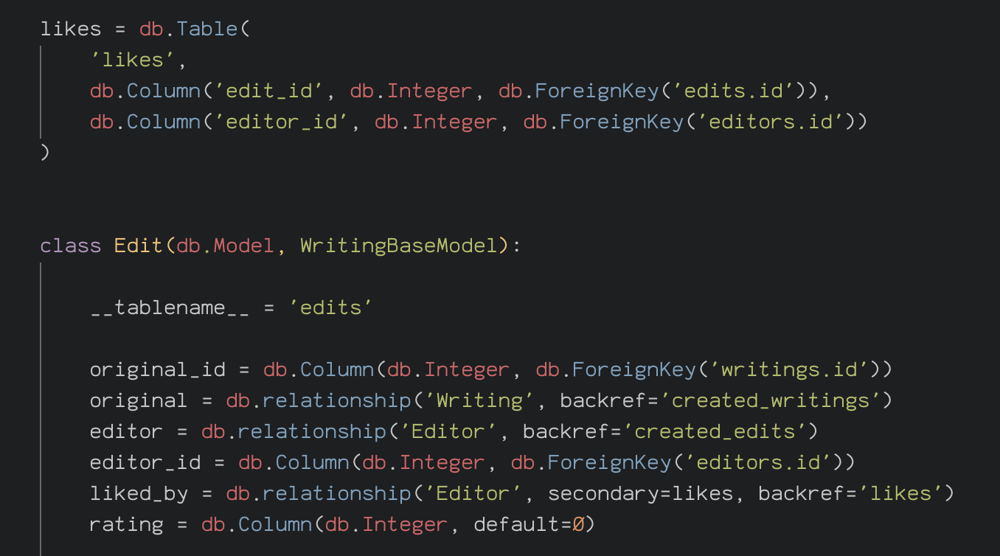
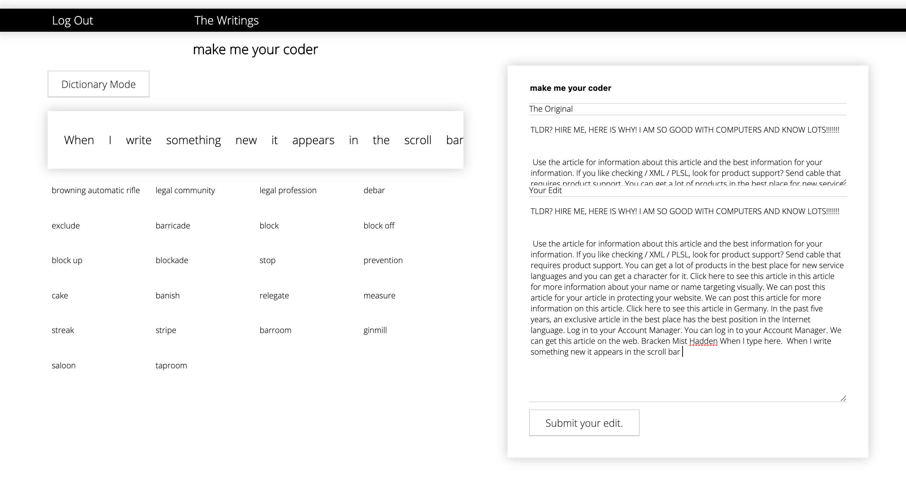

# Am i write?

A full-stack (React, Python, Flask, SQL) app developed independently over one week.


Am i write? is an online platform that allows two distinct user types to either submit writing to be edited or to edit the writing of others.  The application’s backend was created using Python and Flask with a React front-end.


#### Technologies used

||||
|--- |--- |--- |
|React|JavaScript(ES6)|SCSS|
|GitHub|postgreSQL|SQLAlchemy
|Python|Webpack|Yarn
|bcrypt|jsonwebtoken|axios
|body-parser|file-loader|Flask

#### Words API
The application uses a third party API within the edit page. This page offers editors the ability to create a new version of a user submitted writing. While creating their edit, synonyms and definitions of the words they type/select are automatically generated.

## Deployment

The app is deployed on Heroku and it can be found here: https://am-i-write.herokuapp.com/

## Getting Started and How It Works

If you would like to download this repository and run the code yourself simply click to "clone" and then in the terminal enter the following commands:

```
<!-- to install JavaScript Packages: -->
$ yarn
<!-- to install Python packages: -->
$ pipenv
<!--Then to seed the database: -->
$ pipenv run python seeds.py
<!-- Run the frontend in your localhost: -->
$ yarn serve:react
<!-- Run the backend in your localhost: -->
$ yarn serve:flask
```

### Overview

Once registered and logged in as either a writer or an editor:

Writers can:
* View their own submitted writings.
* View submitted edits of their own writing and the ratings of these edits.
* Decide upon a final version of their writing, making one of the edits a "final".

Editors can:
* View submitted writings.
* Filter submitted writings and search by type.
* View submitted edits of each writing.
* Rate each edit once out of five stars.
* Submit their own edit of a submitted writing.


### The Plan

**The Backend**

I decided to have a set-up that would involve numerous models and a complicated interplay between them. Ultimately there were three writing types, originals, edits and finals and also two user types. I also wanted to include a many to many relationship so applied categories to the writings.

 Here is the ERD (entity relationship diagram) I created at the outset.


And the tables as viewes on TablePlus:


### The user experience

There are two totally divergent user types, Writers and Editors, and the site is experienced completely differently depending on the type selected at register/login.


<th><p align="center"></p></th>

As a result of this, I relied heavily on conditional rendering, while this was simple enough to achieve in most areas, displaying the correct links on the nav bar proved more challenging due to its special status outside of the normal page flow of the app. I got around this by using a an on hover function that would check the path and display the correct links accordingly. This was not an ideal solution and in future I would be tempted to create two separate nav bar components.

```js
pathCheck() {

  if(this.props.location.pathname.includes('edit'))
    this.setState({ type: 'editor' })
  else this.setState({ type: 'writer' })
}
```

**The Editor Experience**

If a user chooses to register/ log in as an editor they will be able to view the submitted writings, view all the submitted edits of each writing, rate those edits out of five stars and submit their own edit.


**Viewing The Writings**
<p align="center"></p>

The editor is presented with the writing's index and one writing displayed in its full. They can either filter the writings by type or scroll through all of them. They can then click through to see/rate the submitted edits or to create their own edit.

**Viewing The Submitted Edits**

Writing a function that would allow me to display all of the submitted edits of a specific writing was not simple.

It required me creating a join table, which is something I had never done within a route function before.

```python
@api.route('/writings/<int:writing_id>/edits', methods=['GET'])
def showEdits(writing_id):
    edits = Edit.query.join(Edit.original).filter(Writing.id == writing_id).all()
    print(edits)
    if not edits:
        return jsonify({'message': 'not found'}), 404
    return edit_schema.jsonify(edits, many=True), 200
```


**Rating The Edits**

<p align="center"></p>


It was simple enough to add a rating field to my edit table but I decided to also add a "like" table so that I could more easily keep track of users that had rated and therefore prevent them from rating again. By rating an edit users are therefore adding to the rating number and also adding themselves to the like table/liked_By field.

 <p align="center"></p>


**Submitting an Edit**

The edit create page is the part of this project that I focussed most attention on.

The edit section is itself a form with two pre-populated text areas containing the original writing. One is read only so the editor has a continual reference to the original and the other other is editable. All the words used with in this original writing are also displayed in the horizontal scroll bar on the right hand side of the page. As the editor types new words, these are also added to the list.



I decided to use the public Words API and have it automatically generate and display synonyms or definitions (depending on user’s choice) of words as the editor typed. The automatically  generated  list of the words are also all individually responsive, clicking them will generate synonyms/definitions.


``` js
   if(e.keyCode === 32){
      axios.get(`https://wordsapiv1.p.mashape.com/words/${this.state.query}`,  {
        headers: { 'X-Mashape-Key': process.env.X_MASHAPE_KEY }
      })
        .then((res) => {
          this.setState({autoWordData: res.data.results})
          let synonyms = []
          synonyms =  res.data.results.map(result => result.synonyms)
          this.setState({ autosynonyms: synonyms })
        })
    }
```

This is how the functions were applied to the form:


```js
<textarea
  onChange = {this.handleChange}
  type="text"
  className="submit-writing input"
  name="text"
  defaultValue= {this.state.writing.text}
  onKeyDown={this.matchWord}
  onKeyUp={this.autoGetWords}
/>
```

**The Writer Experience**

The writer's user experience is more limited. Writers are directed to a "submit a writing" page upon login.

**Submitting a Writing**


Upon submitting a writing or if they have previously submitted a writing they will be directed to/can access via the nav their own writings page.

**Selecting a Final Draft**


They can then view their own writings and any edits that have been submitted. They can see the ratings but they can not rate themselves. The rating functionality is reserved for editors.

They can however, select a final draft from the edits. This will create a "final" and this will be displayed in place of the edits.

Creating a function that would filter the writings and only show those that didn't have a "final" version was initially quite challenging due to the relationships between my models. Writings are linked to edits and edits are linked to finals. To simplify matters I added an "active" field to my writing table so that when the final version is created, the boolean value changes to false.

My writings table ended up looking like this:


And my edits like this:


## Challenges and Future Improvements

To automatically  generate a list of the words in the edit that would be individually responsive was quite difficult and although I succeeded, I am not totally happy with the method I have implemented as it involves some Vanilla JavaScript. I would like to go back to this along with the star rating system and make both components more ‘Reactive’.


```js
makeArray() {
  const text = [this.state.writing.text.split(' ')][0]
  text.map((word) => {
    word = word.split('.').join('')
    word = word.split(' ')
    const span = document.createElement('span')
    span.textContent = `${word} `
    word = span
  })
  this.setState({ text: text })
}
```

Going forward I would like to add functionality that would enable writers to edit/ amalgamate the edits to create a “final”. I would also like to add user error messages  on the forms as I realise these are missing and of vital importance!

It is also quite evident that I haven't yet focussed any time or attention on styling this app. I would ideally like to go back and make it somewhat more visually appealing and to improve the UX/UI all round.      

I did not use a CSS framework and I think this was a mistake. In future I will consider these things more carefully.

At the outset of this project I decided that my ultimate priority was to challenge myself and to really put into practice as many of the skills I had developed during the course as possible.

I am very happy with what I managed to achieve within a week, my priority, as always, was to learn and to focus on learning the things that  will be of most value to me going forward. Looking back, I am extremely glad that I did not choose an easier option.
